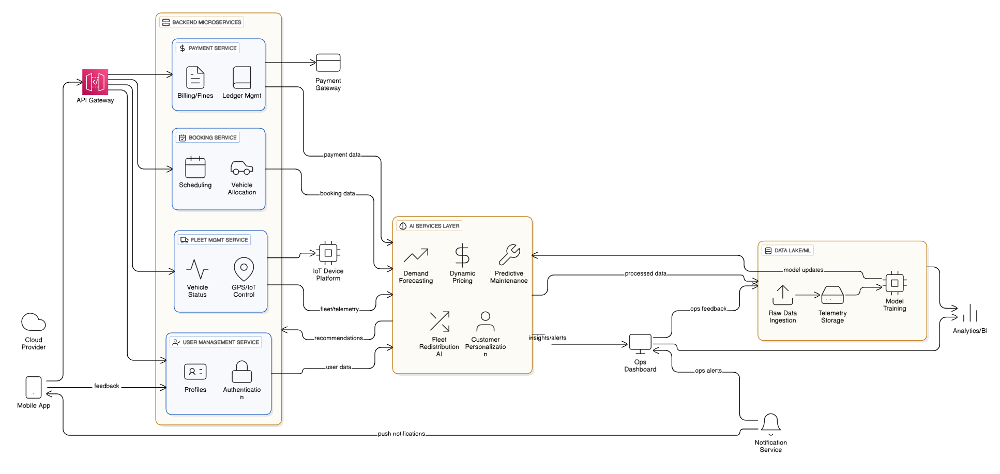
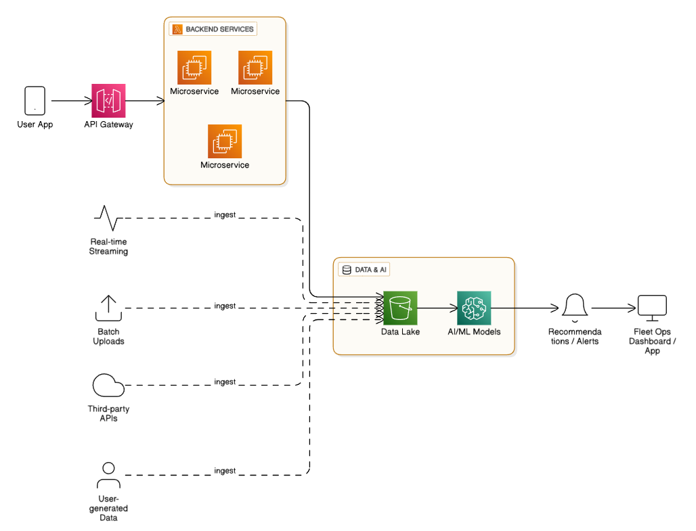

**Overview:**

AI is the operative layer converting MobilityCorp’s raw telemetry, usage signals, and customer data into operational decisions and revenue levers. Forecasting models predict demand at bay-level granularity; battery-depletion models prioritize swaps for scooters and bikes; vision and OCR models validate returns and charger-plug status; NLP and classification automate feedback triage and fraud detection; recommender and personalized pricing drive subscription adoption; routing and vehicle-rebalancing optimization assigns staff tasks. Models run as real-time inference for operational control and as batched analytics for strategic planning. The architecture below integrates these AI services into a resilient telemetry-first MobilityCorp platform.

**High-level architecture (core components)**

1. MobilityCorp Mobile App (iOS/Android)
   1. Auth (OAuth2, device attestation), NFC unlock/lock, real-time vehicle state display, photo upload for return, in-app payments.
   1. Local offline cache for booking tokens and unlock commands; end-to-end encrypted command channel to MobilityCorp vehicle gateway.
1. Vehicle Telemetry & Control Layer
   1. Edge Gateway on each MobilityCorp vehicle: secure agent publishing GPS, battery, lock/unlock events, charger-plug sensor, tamper alerts.
   1. Command channel supports authenticated unlock/disable and OTA flags; all commands signed with MobilityCorp-managed PKI.
1. Telemetry Ingestion Pipeline
   1. High-throughput message bus (Kafka/Kinesis) accepts MobilityCorp telemetry + mobile events.
   1. Stream processing (Flink/Streams) enriches with geofences, bay metadata, device health, sliding aggregates.
1. Real-time Fleet State Store
   1. Time-series DB for telemetry (TimescaleDB/Influx) + geo-indexed fast store (Redis/Elasticsearch) for nearest-vehicle queries and availability.
   1. Materialized views for pricing/booking decisions used by MobilityCorp services.
1. Core Transactional Services (microservices)
   1. Booking Service: enforces MobilityCorp booking rules (7 days for cars/vans, 30 minutes for micromobility), holds, concurrency control.
   1. Billing & Payments: per-minute meter, fines calculation for wrong location/late return, invoicing, refunds, payment gateway integrations.
   1. Fleet Management: register MobilityCorp vehicles, GPS, battery states, charger status, remote disable.
   1. Returns Verification: orchestrates photo submission, image inference, and return finalization for MobilityCorp.
   1. Staff Ops: tasks, routing, swap instructions, bay status dashboard for MobilityCorp technicians.
   1. Customer Profile & Subscriptions: loyalty, commute plans, dynamic discounts for MobilityCorp customers.
1. Data Platform & Analytics
   1. Event lake (object storage) + warehouse (ClickHouse/BigQuery) for MobilityCorp analytics.
   1. Feature store (Feast) for ML features.
   1. Model registry & orchestration (MLflow / Kubeflow Pipelines).
   1. Experimentation platform + monitoring for model drift.
1. AI / ML Services
   1. Demand Forecasting: bay × hour × day models using external signals (events, weather, transit).
   1. Battery Depletion Predictor: per-MobilityCorp-vehicle remaining energy and swap priority.
   1. Rebalancing & Routing Optimizer: solver + heuristics for MobilityCorp staff routing.
   1. Return Photo Verification: computer vision to confirm vehicle, bay marker, charger plug (cars/vans), and damage detection.
   1. Anomaly Detection & Safety: streaming model to detect theft, spoofed GPS, misuse patterns.
   1. Personalized Engagement & Pricing: recommender to convert MobilityCorp users to subscriptions and dynamic per-minute pricing.
   1. Feedback Triage (NLP): classifies MobilityCorp customer reports into urgent maintenance, billing disputes, abuse.
   1. Simulator / What-if Engine: models MobilityCorp policy impacts before rollouts.
1. Operations & Staff Tools
   1. Dispatch web app with prioritized task queue, route maps, swap details, in-app confirmations for MobilityCorp technicians.
   1. Mobile staff app with barcode/NFC scanning of battery packs, inventory tracking tied to MobilityCorp stock.
1. Security, Compliance, and Reliability
   1. mTLS for vehicle-server; PKI for command signing; HSM/KMS for MobilityCorp secrets.
   1. Audit logs for all remote disables/unlocks.
   1. GDPR/CCPA controls for MobilityCorp PII, retention policies, data minimization.
   1. Role-based access control for MobilityCorp staff tools and ML approvals.

-----
**Core Microservices — Expanded Architecture for MobilityCorp**

Each MobilityCorp microservice is isolated by domain, owns its data, and communicates via an event-driven backbone (Kafka or Kinesis). Services expose REST/gRPC APIs for synchronous requests and publish events for async workflows. Below is a breakdown of each microservice, its core functions, data model, integrations, and AI augmentations.

-----
**1. User and Identity Service**

**Purpose:** Manage all MobilityCorp customer accounts, authentication, authorization, and KYC details.

**Responsibilities:**

- User registration, login, and verification (OAuth2 + MFA)
- Manage personal data, payment methods, communication preferences
- Handle KYC (driver license, ID verification for cars/vans)
- Generate and verify JWT tokens for API requests
- Integrate with MobilityCorp’s fraud detection system for identity misuse

**Data Model:**

- user\_id, email, phone, verified\_documents, subscription\_status
- roles: customer, staff, admin
- auth\_tokens, refresh\_tokens

**AI Integration:**

- Identity anomaly detection (e.g., multiple users with same payment card)
- Risk scoring on new registrations using device fingerprinting
- Adaptive authentication (stricter checks for high-risk sessions)
-----
**2. Vehicle Management Service**

**Purpose:** Maintain MobilityCorp’s master record for all vehicles—scooters, bikes, cars, and vans.

**Responsibilities:**

- Vehicle registration and metadata (VIN, make, model, battery type)
- GPS tracking and health data ingestion
- Remote commands (unlock, lock, disable, firmware updates)
- Manage charger status and plug-in verification (for cars/vans)
- Synchronize with IoT Edge Gateway

**Data Model:**

- vehicle\_id, type, status, current\_location, battery\_level
- health\_metrics, firmware\_version, assigned\_parking\_bay

**AI Integration:**

- Predictive maintenance model to flag vehicles likely to fail
- Usage pattern analytics to detect abuse or tampering
- Smart disable decisioning (verify multiple anomalies before disable)
-----
**3. Booking Service**

**Purpose:** Handle vehicle reservations, enforce business rules, and manage concurrent bookings.

**Responsibilities:**

- Manage lifecycle of bookings (create → active → completed → archived)
- Apply time-window logic (7 days advance for cars/vans, 30 min for micromobility)
- Prevent double-booking of vehicles
- Calculate estimated cost and expected return time
- Integrate with Billing Service for live metering

**Data Model:**

- booking\_id, user\_id, vehicle\_id, start\_time, end\_time, status
- pricing\_plan, expected\_cost, actual\_duration

**AI Integration:**

- Demand forecasting for surge pricing and vehicle allocation
- Predictive booking suggestions (e.g., "commute reminders" for repeat users)
- Fraud detection for duplicate or ghost bookings
-----
**4. Billing and Payments Service**

**Purpose:** Compute costs, apply fines, and integrate with external payment gateways.

**Responsibilities:**

- Live metering for per-minute rental cost
- Handle late return and wrong-location fines
- Support payment capture, refunds, and invoices
- Integrate with third-party gateways (Stripe, Adyen)
- Maintain audit logs for regulatory compliance

**Data Model:**

- invoice\_id, booking\_id, charges, fines, payment\_status
- payment\_method, transaction\_id, audit\_logs

**AI Integration:**

- Dynamic pricing model based on demand, time of day, and availability
- Fraud detection on chargebacks and abnormal payment activity
- Personalized discounting and loyalty scoring
-----
**5. Return Verification Service**

**Purpose:** Validate that returned vehicles meet MobilityCorp’s conditions—location, charger plug, photo proof.

**Responsibilities:**

- Accept and validate return submissions from the app
- Run photo verification pipeline (CV model + metadata validation)
- Validate geolocation against designated bay
- Determine fine or acceptance outcome

**Data Model:**

- return\_id, booking\_id, vehicle\_id, bay\_id
- return\_time, photo\_urls, status, confidence\_score

**AI Integration:**

- Computer vision for vehicle identification, charger-plug detection
- Image tamper detection and GPS consistency checks
- Damage assessment model to flag maintenance issues automatically
-----
**6. Fleet Operations Service**

**Purpose:** Manage operational staff activities for battery swaps, rebalancing, and maintenance.

**Responsibilities:**

- Task queue for staff: battery swaps, vehicle relocation, damage inspection
- Real-time location tracking of staff vans
- Generate optimized routing plans for daily operations
- Track completion and feedback of assigned tasks

**Data Model:**

- task\_id, vehicle\_id, task\_type, priority\_score
- assigned\_to, status, route\_plan, completion\_time

**AI Integration:**

- Routing optimization engine (vehicle clustering + route solver)
- Battery depletion model for prioritizing swaps
- Dynamic task reallocation based on forecasted demand and live conditions
-----
**7. Feedback and Maintenance Service**

**Purpose:** Process customer feedback, create maintenance tickets, and escalate issues.

**Responsibilities:**

- Capture feedback from app (text, images, categories)
- Auto-classify issues (mechanical, cleanliness, charger issue, etc.)
- Route tickets to appropriate MobilityCorp team
- Link recurring issues to vehicle or bay

**Data Model:**

- ticket\_id, source, type, severity, linked\_vehicle\_id
- description, status, resolution\_time

**AI Integration:**

- NLP text classification to auto-tag ticket category
- Sentiment analysis for prioritizing urgent/negative feedback
- Predictive maintenance based on aggregated complaint patterns
-----
**8. Notification and Communication Service**

**Purpose:** Handle all outbound communication with users and staff.

**Responsibilities:**

- Push notifications for booking updates, reminders, payment confirmations
- SMS/email for billing and important alerts
- Staff dispatch notifications and reminders

**Data Model:**

- message\_id, recipient, type, status, delivery\_time

**AI Integration:**

- Smart notification timing based on user behavior patterns
- Personalization of messaging tone/content to improve engagement
- Predictive re-engagement for inactive MobilityCorp users
-----
**9. Analytics and Insights Service**

**Purpose:** Provide business intelligence dashboards, performance metrics, and model feedback loops.

**Responsibilities:**

- Aggregate data across all MobilityCorp microservices
- Expose analytics APIs for business reporting
- Maintain feature store for ML models
- Support A/B testing and experimentation

**Data Model:**

- Aggregated metrics tables, model version logs, KPI histories

**AI Integration:**

- Continuous model evaluation (drift, bias, retraining triggers)
- KPI anomaly detection to identify systemic issues
- Simulation engine for policy and pricing experiments
-----
**10. Geo and Demand Forecasting Service**

**Purpose:** Core AI engine to predict where and when vehicles will be needed.

**Responsibilities:**

- Predict demand per bay per 15-min window
- Feed predictions into the Booking and Fleet Ops services
- Calculate supply–demand gaps and suggest repositioning

**Data Model:**

- bay\_id, timestamp, predicted\_demand, confidence\_interval

**AI Integration:**

- Time-series forecasting models (Prophet, LSTM, or Temporal Fusion Transformer)
- Incorporate weather, events, holidays, and historical usage data
- Adaptive learning loop from real outcomes
-----
**11. Admin and Policy Service**

**Purpose:** Central configuration and control for pricing, fines, and operational policies.

**Responsibilities:**

- Define and update MobilityCorp rulesets: fines, booking windows, surge multipliers
- Manage user roles and permissions across microservices
- Versioned policy registry

**Data Model:**

- policy\_id, type, parameters, valid\_from, valid\_to, active\_version

**AI Integration:**

- Policy simulation engine predicting impact on demand and revenue
- Policy recommendation system using reinforcement learning on simulated environment
-----
**Inter-service Communication Summary**

- **Synchronous REST/gRPC** for critical flows: booking, payment, unlock/lock.
- **Asynchronous event bus (Kafka/Kinesis)** for telemetry, status updates, and long-running tasks.
- **Service Mesh (Istio/Linkerd)** for secure traffic routing, observability, and retries.
- **Circuit breakers and retries** for interdependent services.
-----
**Example Data Flow (Booking Lifecycle)**

1. **User** requests booking via app → API Gateway → Booking Service.
1. **Booking Service** validates availability via Vehicle Management.
1. Booking created → emits booking.created event → Billing, Fleet Ops, and Analytics services subscribe.
1. On trip end, **Return Verification** consumes photo → validates → emits return.completed.
1. **Billing** finalizes charges, triggers payment.
1. **Feedback Service** awaits user input → NLP classification → opens ticket if needed.
1. **Fleet Ops** consumes return event → updates vehicle state, triggers maintenance or swap task if flagged by model.
-----
**Data flows (concise)**

1. MobilityCorp vehicle → telemetry → ingestion bus → stream enrichment → realtime state store + time-series DB + event lake.
1. MobilityCorp mobile app → booking/payment → Booking Service → ACID commit in Postgres → event emitted to bus.
1. Streaming models consume telemetry and bay state → emit swap priorities / anomaly alerts → Staff Ops & Routing Optimizer.
1. Photo uploaded at return → Vision inference (synchronous) → Returns Service marks accepted/rejected and triggers fines if MobilityCorp policy requires.
1. Batch pipelines train/retrain models from event lake → validated in staging → promoted to production via model registry.

**AI specifics — models, inputs, outputs, evaluation**

- Demand forecasting
  - Inputs: historical MobilityCorp rentals (bay-level), time features, weather, transit schedules, events, promotions.
  - Outputs: demand probability per bay per 15-min interval; uncertainty bands.
  - Eval: MAPE & calibration; operational KPI: reduced unmet demand for MobilityCorp.
- Battery prioritization
  - Inputs: telemetry (SOC, trip energy), trip history, ambient temperature, charger availability.
  - Outputs: swap-priority score + ETA-to-empty for MobilityCorp techs.
  - Eval: precision/recall for outages prevented; KPI: reduction in mid-trip failures for MobilityCorp.
- Returns validation (vision)
  - Inputs: MobilityCorp customer images, bay ID, timestamps.
  - Outputs: accept/reject, damage tags, charger-plug bool, confidence.
  - Eval: precision > 98% for accept/reject; human-in-loop for low-confidence MobilityCorp cases.
- Rebalancing optimizer
  - Inputs: forecasted demand, vehicle locations, staff availability, battery levels.
  - Outputs: prioritized tasks and optimized routes for MobilityCorp operations.
  - Eval: A/B tests measuring fulfilled demand per shift and operational cost per rebalanced unit.
- Fraud/anomaly detection
  - Inputs: GPS patterns, unlock events, rapid movement, telemetry gaps, payment anomalies.
  - Outputs: alert level, suggested action (remote disable, manual review).
  - Eval: controlled false positives via human review; measured reduction in MobilityCorp losses.

**Engineering decisions & trade-offs**

- Real-time vs batch inference: time-critical MobilityCorp actions (unlock, disable, return validation, swap priority) use low-latency endpoints; long-range forecasts run batched to reduce cost.
- On-device inference: lightweight mobile pre-filters for images to save bandwidth; core inference on MobilityCorp servers for consistency and audit.
- Edge resiliency: vehicles and app support offline unlock tokens with short TTL signed by MobilityCorp to prevent service interruption.
- Data retention: MobilityCorp stores detailed telemetry hot for 90 days, aggregates long-term for model retraining.

**Operationalization & governance**

- CI/CD for models: tests, shadow mode, canary rollout, rollback, drift detection alerts for MobilityCorp models.
- Human-in-loop for edge cases: low-confidence vision/anomaly cases route to MobilityCorp ops humans before punitive actions.
- Explainability: thresholded rules and model explanations for high-impact MobilityCorp actions logged and recoverable.
- Monitoring: model latency, distribution shifts, and business KPIs mapped to model versions used by MobilityCorp.

**Technical stack (recommended)**

- Cloud: AWS
- Ingestion: Kafka or managed streaming (Kinesis).
- Stream processing: Flink / Kafka Streams.
- Databases: Postgres for transactions; TimescaleDB for time-series; Redis for state; ClickHouse/BigQuery for analytics.
- Object storage: S3/compatible.
- ML infra: Feature store (Feast), MLflow + Kubeflow, Triton/FastAPI for model serving.
- Orchestration: Kubernetes for MobilityCorp microservices & model servers.
- Auth & security: OAuth2, Vault/KMS, mTLS, HSM for MobilityCorp keys.
- Observability: Prometheus, Grafana, OpenTelemetry, Sentry.
- Payment: PCI-compliant gateway (Stripe/Adyen) with tokenization for MobilityCorp payments.

**Roadmap (phased deliverables for MobilityCorp)**

1. Phase 0 — Stabilize telemetry and booking
   1. Implement secure telemetry ingestion, core booking/metering, mobile unlock flow, transactional DB for MobilityCorp.
   1. Quick-win: returns photo upload storage and manual verification.
1. Phase 1 — Basic AI and operations tooling
   1. Deploy battery predictor and threshold-based swap prioritization for MobilityCorp.
   1. Implement staff ops task queue with geo-routing.
   1. Deploy vision model synchronously with human backup.
1. Phase 2 — Demand forecasting and rebalancing
   1. Deploy bay-level forecasts; integrate with rebalancing optimizer; pilot in one MobilityCorp city.
   1. Add targeted incentives via recommender to increase weekday commute usage.
1. Phase 3 — Advanced automation & experimentation
   1. Full dynamic pricing, subscription trials, automated anomaly response with human-in-loop.
   1. Build simulator for large-policy evaluation; scale ML platform and governance for MobilityCorp.

**Key metrics to instrument (operational)**

- MobilityCorp unmet demand ratio by bay and hour.
- Mid-trip battery depletion incidents per 10k trips.
- Swap crew utilization and kilometers per swap.
- Return acceptance rate and vision-model false positive/negative.
- Time-to-resolve maintenance tickets.
- Conversion rate: ad-hoc → MobilityCorp subscription.
- Cost per fulfilled trip (including rebalancing).

**Implementation-critical constraints for MobilityCorp**

- Vehicle command latency must be bounded and auditable; MobilityCorp must provide signed tokens and retain command logs.
- Photo verification must include human review for low-confidence cases to prevent wrongful fines to MobilityCorp customers.
- GDPR-safe identifiers and opt-out for behavioral features must be implemented by MobilityCorp at design time.
- Any MobilityCorp model output used for punitive action must be explainable and reversible in system UI.

**Deployment & scaling guidance**

- Multiregion for city-level isolation: master control plane in primary region; regional data plane for low-latency MobilityCorp telemetry.
- Autoscale ingestion and model-serving clusters based on telemetry spikes.
- Use feature toggles and canary deploys for MobilityCorp behavior-affecting AI.

**Staffing & capability requirements**

- Core teams: Backend, Embedded/IoT, Mobile, Data Engineering, ML Engineering, Ops/Dispatch product owners for MobilityCorp.
- Initial ML staffing: 1 lead ML engineer, 2 data scientists for forecasting and battery models, 1 ML infra engineer.
- Runbook and on-call rotations for model drift, incidents, and vehicle control actions at MobilityCorp.

**Immediate technical deliverables (first 90 days)**

1. Secure MobilityCorp telemetry ingestion pipeline, sample dataset, schema.
1. Booking service with transactional meter and fine computation.
1. Return photo flow + manual verification dashboard for MobilityCorp.
1. Battery depletion model prototype with prioritized swap-list endpoint.
1. Staff dispatch UI integrated to swap list and route generator for MobilityCorp techs.
1. Baseline demand forecast pipeline for one MobilityCorp pilot bay cluster.

**Failure modes and mitigations for MobilityCorp**

- False disables: require multi-signal confirmation and human approval before MobilityCorp executes high-impact disables.
- Model drift causing missed demand: shadow-mode deployments and retraining schedule; automated drift alerts for MobilityCorp.
- GPS spoofing: cross-validate telemetry with cellular/Wi-Fi signatures and tamper sensors on MobilityCorp vehicles.
- Photo abuse: require geo-tag + time-signed upload + vision confidence; flag repeat offenders for manual review by MobilityCorp.

**Documented APIs (contract highlights for MobilityCorp)**

- Telemetry POST: {vehicle\_id, ts, lat, lon, soc, odo, status, signature}
- Command POST: {vehicle\_id, command, client\_id, nonce, signature} → {cmd\_id, ack\_ts}
- Swap-priority GET: {region, timestamp} → [{vehicle\_id, priority\_score, est\_empty}]
- Return-verify POST: {trip\_id, images[], bay\_id} → {status, reason, confidence}

**Cost control levers for MobilityCorp**

- Tiered inference: lightweight edge/mobile prefilters; heavy models scheduled in batch.
- Use spot/preemptible compute for non-critical batch training.
- Limit high-frequency telemetry retention; downsample after 30–90 days.

**Operational imperative for MobilityCorp**

Treat AI outputs as decision-support until measured reliable in production. Enforce human oversight for actions affecting MobilityCorp customers (fines, remote disable). Continuous measurement of MobilityCorp business KPIs must gate model-driven automation.

